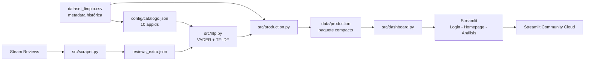

<div align="center">

```
████████╗██╗  ██╗███████╗    ██████╗  █████╗ ████████╗ █████╗
╚══██╔══╝██║  ██║██╔════╝    ██╔══██╗██╔══██╗╚══██╔══╝██╔══██╗
   ██║   ███████║█████╗      ██║  ██║███████║   ██║   ███████║
   ██║   ██╔══██║██╔══╝      ██║  ██║██╔══██║   ██║   ██╔══██║
   ██║   ██║  ██║███████╗    ██████╔╝██║  ██║   ██║   ██║  ██║
   ╚═╝   ╚═╝  ╚═╝╚══════╝    ╚═════╝ ╚═╝  ╚═╝   ╚═╝   ╚═╝  ╚═╝
███╗   ███╗ █████╗  ██████╗██╗  ██╗██╗███╗   ██╗███████╗
████╗ ████║██╔══██╗██╔════╝██║  ██║██║████╗  ██║██╔════╝
██╔████╔██║███████║██║     ███████║██║██╔██╗ ██║█████╗
██║╚██╔╝██║██╔══██║██║     ██╔══██║██║██║╚██╗██║██╔══╝
██║ ╚═╝ ██║██║  ██║╚██████╗██║  ██║██║██║ ╚████║███████╗
╚═╝     ╚═╝╚═╝  ╚═╝ ╚═════╝╚═╝  ╚═╝╚═╝╚═╝  ╚═══╝╚══════╝
```

### Análisis de reseñas de videojuegos con NLP

[](https://www.python.org/)
[](https://streamlit.io/)
[](#calidad-y-pruebas)
[](https://the-data-machine-01.streamlit.app/)

**ESCOM - Instituto Politécnico Nacional · Licenciatura en Ciencia de Datos · DAAD · 4AV1**

[Aplicación web](https://the-data-machine-01.streamlit.app/) · [Arquitectura](docs/ARQUITECTURA.md) · [Resultados](docs/RESULTADOS_Y_LIMITACIONES.md) · [Guía de demo](docs/GUIA_DEMO.md)

</div>

---

## Descripción

**The Data Machine** es una aplicación web que resume la opinión de la comunidad de Steam mediante análisis de sentimiento, extracción de términos relevantes y visualizaciones interactivas.

El proyecto combina dos escalas de información:

- **Contexto histórico:** el dataset limpio contiene 10,348 videojuegos y métricas agregadas que representan 41,407,431 reseñas históricas.
- **Análisis textual detallado:** el pipeline procesa 5,000 reseñas individuales recientes, distribuidas en 10 videojuegos con 500 reseñas por título.

Los 10 juegos seleccionados representan 8,854,428 reseñas históricas en Steam. El modelo NLP no procesa esos 8.85 millones de textos; utiliza sus métricas agregadas como contexto y analiza en detalle la muestra reciente de 5,000 opiniones.

> **Millones de opiniones históricas. 5,000 reseñas recientes analizadas en detalle.**

---

## Aplicación desplegada

**URL pública:** https://the-data-machine-01.streamlit.app/

Flujo de uso:

1. Registrar una cuenta o iniciar sesión con un usuario y contraseña ya guardados.
2. Seleccionar uno de los 10 videojuegos del catálogo.
3. Consultar sentimiento, métricas, temas TF-IDF, tags de Steam, nube de palabras, reseñas y modelos de aprendizaje.
4. Filtrar y descargar resultados.
5. Cerrar sesión desde el menú lateral.

> El registro y el inicio de sesión guardan las cuentas en un archivo JSON local (`data/auth/usuarios.json`, no versionado). Las contraseñas se almacenan en texto plano: es un mecanismo demostrativo para uso académico, no apto para producción.

---

## Alcance implementado

| Elemento | Resultado |
|---|---:|
| Videojuegos activos | 10 |
| Reseñas recientes procesadas | 5,000 |
| Reseñas por videojuego | 500 |
| Términos TF-IDF | 150 |
| Tags de Steam | 150 |
| Reseñas históricas de los 10 juegos | 8,854,428 |
| Modelos de aprendizaje | Reg. logística, Naive Bayes y reg. lineal |
| Pruebas automatizadas | 56 |
| Entorno de producción | Python 3.12 + Streamlit Community Cloud |

Videojuegos incluidos:

`Dota 2`, `Rust`, `Apex Legends`, `The Witcher 3: Wild Hunt`, `ELDEN RING`, `Stardew Valley`, `Phasmophobia`, `Among Us`, `War Thunder` y `Hollow Knight`.

---

## Funcionalidades

- Registro e inicio de sesión con cuentas almacenadas en un archivo JSON local.
- Catálogo visual con portada, géneros, precio, Metacritic y aprobación histórica.
- Scraper de reseñas recientes de Steam con paginación, pausas, reintentos y deduplicación.
- Clasificación de sentimiento con VADER: positivo, neutral y negativo.
- Evaluación binaria de VADER contra `voted_up` para reseñas no neutrales.
- Accuracy, balanced accuracy, precision, recall, F1, cobertura y baseline mayoritario.
- Extracción de términos con TF-IDF usando unigramas y bigramas.
- Comparación con tags comunitarios de Steam.
- Nube de palabras por videojuego.
- Explorador de reseñas con filtros por sentimiento, recomendación y texto.
- Modelos de aprendizaje supervisado: Regresión logística y Naive Bayes sobre TF-IDF para predecir `voted_up`, comparados con VADER y el baseline mayoritario.
- Regresión lineal sobre `weighted_vote_score` con métricas R², MAE y RMSE.
- Matrices de confusión interactivas (Plotly) de VADER y del modelo supervisado.
- Métricas de los modelos precalculadas en JSON y leídas con caché (`st.cache_data`).
- Descarga de reseñas filtradas en CSV y métricas en JSON.
- Navegación multipágina y cierre de sesión.
- Paquete compacto de producción con manifiesto y hashes SHA-256.

---

## Metodología

El proyecto sigue las seis fases de **CRISP-DM**:

1. **Entendimiento del negocio:** condensar grandes volúmenes de opiniones en información útil.
2. **Entendimiento de los datos:** auditar el dataset y distinguir metadata agregada de reseñas individuales.
3. **Preparación:** fijar el catálogo, obtener reseñas recientes, limpiar y deduplicar.
4. **Modelamiento:** VADER para sentimiento, TF-IDF para términos dominantes y modelos supervisados (Regresión logística, Naive Bayes y regresión lineal).
5. **Evaluación:** comparar VADER y los modelos supervisados con `voted_up`, medir cobertura y contrastar con el baseline mayoritario.
6. **Despliegue:** construir la app Streamlit y publicar un paquete reproducible en Community Cloud.

---

## Arquitectura



La explicación completa se encuentra en [`docs/ARQUITECTURA.md`](docs/ARQUITECTURA.md).

---

## Estructura del repositorio

```text
the-data-machine/
├── .streamlit/config.toml
├── app.py
├── requirements.txt
├── README.md
├── config/
│   └── catalogo.json
├── data/
│   ├── auth/
│   │   └── usuarios.json            # cuentas locales (no versionado)
│   ├── processed/
│   │   └── preprocesamiento.py
│   └── production/
│       ├── catalogo_10_juegos.csv
│       ├── reviews_analizadas.csv
│       ├── metricas_sentimiento.json
│       ├── temas_tfidf.csv
│       ├── tags_steam.csv
│       ├── modelos_clasificacion.json
│       ├── modelos_regresion.json
│       └── manifest.json
├── notebooks/
│   ├── 01_eda.ipynb
│   ├── 02-vader.ipynb
│   ├── 03_temas.ipynb
│   └── 04_homepage_guide.ipynb
├── pages/
│   ├── login.py
│   ├── homepage.py
│   └── analisis.py
├── scripts/
│   ├── verificar_base.py
│   ├── preparar_datos_produccion.py
│   ├── preparar_modelos.py
│   ├── validar_bloque5c.py
│   └── prueba_arranque_streamlit.py
├── src/
│   ├── auth.py
│   ├── scraper.py
│   ├── nlp.py
│   ├── modelos.py
│   ├── dashboard.py
│   ├── navigation.py
│   ├── menu_usuario.py
│   ├── data_paths.py
│   ├── production.py
│   └── styles.py
└── tests/
    ├── test_auth.py
    ├── test_scraper.py
    ├── test_nlp.py
    ├── test_modelos.py
    ├── test_dashboard.py
    ├── test_navigation.py
    ├── test_menu_usuario.py
    ├── test_production.py
    └── test_deployment.py
```

---

## Instalación local

### Requisitos

- Python 3.12
- Git
- Conexión a internet para instalar dependencias

### Ejecución

```bash
git clone https://github.com/MelSurikun/the-data-machine.git
cd the-data-machine

python -m venv .venv
```

Windows PowerShell:

```powershell
.\.venv\Scripts\Activate.ps1
python -m pip install --upgrade pip
python -m pip install -r requirements.txt
python -m streamlit run app.py
```

Linux/macOS:

```bash
source .venv/bin/activate
python -m pip install --upgrade pip
python -m pip install -r requirements.txt
python -m streamlit run app.py
```

La aplicación estará disponible en `https://the-data-machine-01.streamlit.app/`.

---

## Datos

### Fuente maestra

`dataset_limpio.csv` es el dataset depurado utilizado durante el desarrollo. Debido a su tamaño, no se incluye directamente en el repositorio.

### Paquete de producción

La aplicación desplegada utiliza `data/production/`, que contiene únicamente los 10 juegos y los resultados NLP necesarios. `manifest.json` registra:

- appids incluidos;
- número de filas;
- tamaño en bytes;
- hashes SHA-256;
- hash del dataset fuente.

Para regenerar el paquete desde las fuentes locales:

```powershell
python scripts/preparar_datos_produccion.py
python scripts/validar_bloque5b.py
```

### Modelos de aprendizaje

Para reentrenar los modelos supervisados y regenerar sus métricas:

```powershell
python scripts/preparar_modelos.py
```

Genera `data/production/modelos_clasificacion.json` y `data/production/modelos_regresion.json`, que la aplicación solo lee (cacheados con `st.cache_data`). El entrenamiento es local, no requiere internet y usa `data/production/reviews_analizadas.csv` como fuente.

---

## Calidad y pruebas

Ejecutar las 56 pruebas:

```powershell
python -m unittest discover -s tests -v
```

Validación de despliegue:

```powershell
python scripts/validar_bloque5c.py
python scripts/prueba_arranque_streamlit.py
```

Cobertura funcional de las pruebas:

- registro, autenticación y persistencia de cuentas;
- normalización y combinación de reseñas;
- clasificación y evaluación NLP;
- modelos supervisados de clasificación y regresión;
- carga y transformación del dashboard;
- navegación y sesión;
- menú y logout;
- rutas y hashes de producción;
- dependencias, codificación y arranque headless.

---

## Resultados y limitaciones

En los 10 videojuegos, la evaluación binaria sobre las reseñas no neutrales obtuvo:

- accuracy promedio: **80.4 %**;
- balanced accuracy promedio: **72.6 %**;
- cobertura no neutral promedio: **74.1 %**;
- 7 de 10 juegos alcanzaron al menos 75 % de accuracy;
- 4 de 10 juegos superaron el baseline mayoritario.

Una accuracy elevada no implica necesariamente un modelo superior al baseline en juegos con clases altamente desbalanceadas. Los resultados completos y su interpretación están en [`docs/RESULTADOS_Y_LIMITACIONES.md`](docs/RESULTADOS_Y_LIMITACIONES.md).

Adicionalmente, los modelos supervisados entrenados sobre el corpus completo (5,000 reseñas) para predecir `voted_up` a partir del texto alcanzaron, en el conjunto de prueba, una accuracy de hasta 88.3 % (Naive Bayes) frente a 81.9 % de VADER. Aun así, VADER conserva mejor balanced accuracy debido al desbalance de clases, lo que se reporta de forma explícita en la aplicación. La regresión lineal sobre `weighted_vote_score` obtuvo un R² cercano a 0.47.

---

## Limitaciones principales

- El corpus textual detallado se limita a 500 reseñas recientes por juego.
- VADER está optimizado para inglés y puede fallar con sarcasmo, jerga y contexto complejo.
- La selección de reseñas recientes no representa necesariamente toda la historia del videojuego.
- El login guarda las cuentas en un JSON local con contraseñas en texto plano; es demostrativo para uso académico y no apto para producción.
- Los modelos supervisados se entrenan sobre el corpus global, no por videojuego.
- La nube de palabras es descriptiva; no reemplaza una modelación temática avanzada.

---

## Trabajo futuro

- Parametrizar juegos, número de reseñas y cantidad de temas.
- Almacenar reseñas en Parquet o una base de datos por `appid` y fecha.
- Incorporar procesamiento incremental y tareas en segundo plano.
- Detectar idioma y añadir soporte para español.
- Extender la comparación de VADER hacia modelos basados en Transformers (la comparación con modelos supervisados clásicos ya está implementada).
- Reforzar la autenticación con hash de contraseñas y roles para uso en producción.
- Automatizar CI para pruebas y despliegue.

---

## Equipo

| Integrante | Participación principal |
|---|---|
| **Hernández López Melanie** | Arquitectura inicial, ingesta/EDA, Homepage y colaboración en integración |
| **Sojo Ponce Melina Valeria** | Login y sesión, prototipo de sentimiento y funciones de exportación |
| **Navarrete Flores Yariel** | Preprocesamiento, scraper, TF-IDF, dashboard, pruebas, producción, despliegue y documentación técnica |

---

## Contexto académico

- **Instituto Politécnico Nacional**
- **Escuela Superior de Cómputo**
- **Licenciatura en Ciencia de Datos**
- **Unidad de aprendizaje:** Desarrollo de Aplicaciones para Análisis de Datos
- **Grupo:** 4AV1
- **Semestre:** cuarto semestre, 2026

---

## Documentación

- [`docs/ARQUITECTURA.md`](docs/ARQUITECTURA.md)
- [`docs/RESULTADOS_Y_LIMITACIONES.md`](docs/RESULTADOS_Y_LIMITACIONES.md)
- [`docs/GUIA_DEMO.md`](docs/GUIA_DEMO.md)
- [`docs/RELEASE_CHECKLIST.md`](docs/RELEASE_CHECKLIST.md)

---

## Referencias principales

- Hutto, C. J., & Gilbert, E. (2014). *VADER: A Parsimonious Rule-based Model for Sentiment Analysis of Social Media Text*.
- Scikit-learn. `TfidfVectorizer` documentation.
- Streamlit documentation and Streamlit Community Cloud.
- Valve/Steam Store endpoints utilizados para metadata y reseñas.
- CRISP-DM 1.0: Step-by-step data mining guide.

---

<div align="center">

**The Data Machine · ESCOM-IPN · 2026**

</div>
