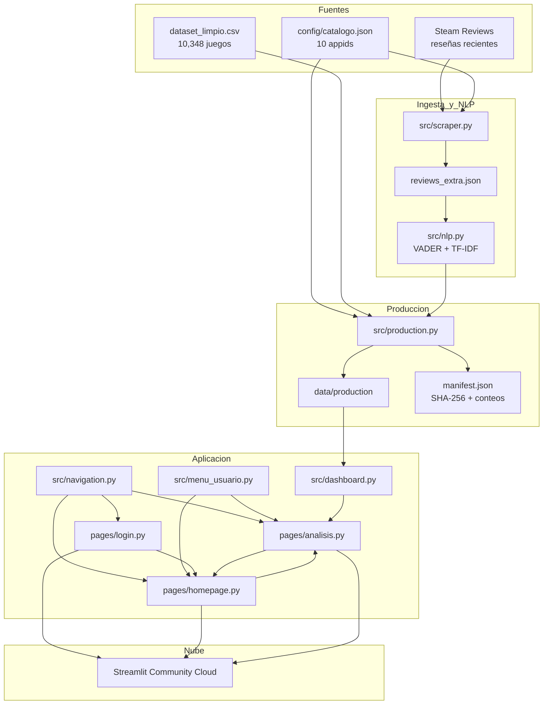
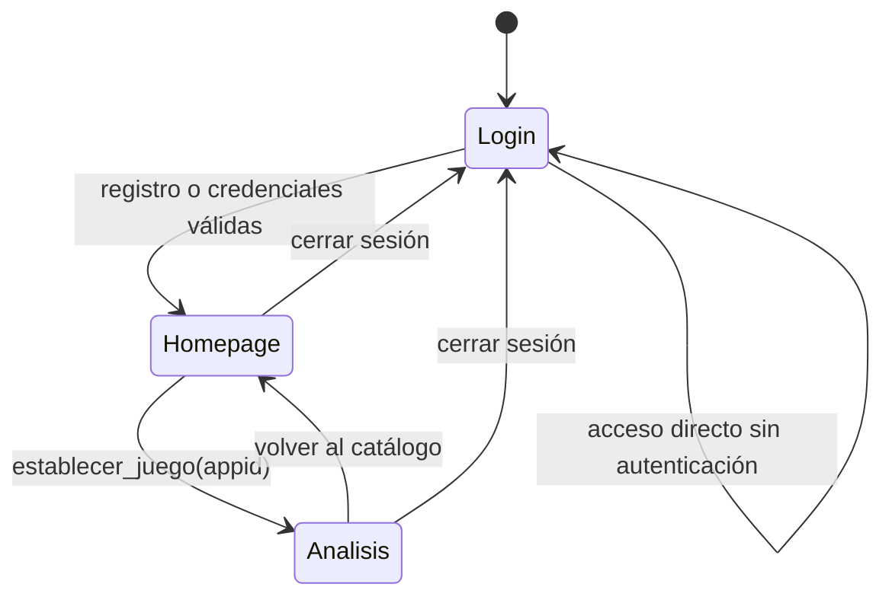

# Arquitectura de The Data Machine

## 1. Propósito

La arquitectura separa adquisición, procesamiento NLP, persistencia de resultados y presentación. Esta separación evita ejecutar scraping o TF-IDF durante cada interacción del usuario y permite desplegar un paquete compacto en Streamlit Community Cloud.

## 2. Vista general

## 3. Capas

### 3.1 Datos

- `dataset_limpio.csv`: fuente maestra local de metadata y métricas históricas.
- `config/catalogo.json`: catálogo oficial y orden estable de los 10 juegos.
- `reviews_extra.json`: reseñas recientes adquiridas antes del despliegue.
- `data/production/`: subconjunto compacto utilizado en producción.

### 3.2 Ingesta

`src/scraper.py` obtiene reseñas por `appid`. Sus responsabilidades incluyen:

- consulta por páginas;
- normalización de campos;
- limpieza de HTML;
- reintentos y pausas;
- combinación con ejecuciones previas;
- deduplicación mediante hash;
- escritura atómica.

### 3.3 NLP

`src/nlp.py` procesa cada reseña con:

- VADER de NLTK;
- umbrales `compound >= 0.05`, `compound <= -0.05` y neutral entre ambos;
- evaluación binaria contra `voted_up` para reseñas no neutrales;
- TF-IDF con unigramas y bigramas;
- extracción de 15 términos por juego;
- normalización de tags comunitarios.

### 3.4 Producción

`src/production.py` genera un paquete reproducible:

| Archivo | Contenido |
|---|---|
| `catalogo_10_juegos.csv` | Metadata de 10 videojuegos |
| `reviews_analizadas.csv` | 5,000 reseñas con sentimiento y variables auxiliares |
| `metricas_sentimiento.json` | Métricas por juego |
| `temas_tfidf.csv` | 150 términos relevantes |
| `tags_steam.csv` | 150 tags de Steam |
| `manifest.json` | Hashes, tamaños, filas y appids |

`src/data_paths.py` prioriza este paquete y mantiene una ruta de respaldo para desarrollo local.

### 3.5 Presentación

- `app.py`: enrutador inicial.
- `pages/login.py`: login y registro, con cuentas guardadas en `data/auth/usuarios.json` (texto plano, demostrativo).
- `pages/homepage.py`: catálogo y selección.
- `pages/analisis.py`: dashboard con cinco pestañas (Resumen, Sentimiento, Temas y nube, Reseñas y descarga, Modelos de aprendizaje).
- `src/auth.py`: registro, verificación de credenciales y persistencia de cuentas en JSON.
- `src/dashboard.py`: carga y transformaciones para visualización.
- `src/navigation.py`: sesión y `selected_appid`.
- `src/menu_usuario.py`: barra lateral y cierre de sesión.
- `src/styles.py`: identidad visual.

### 3.6 Modelos de aprendizaje

`src/modelos.py` añade modelos supervisados como complemento a VADER:

- clasificación de `voted_up` desde el texto con LogisticRegression y MultinomialNB sobre TF-IDF (mismas stopwords de dominio que `src/nlp.py`);
- comparación contra VADER y el baseline mayoritario sobre el mismo conjunto de prueba (accuracy, balanced accuracy, precision, recall, F1, matriz de confusión);
- regresión lineal sobre `weighted_vote_score` con métricas R², MAE y RMSE.

`scripts/preparar_modelos.py` entrena y guarda las métricas en `data/production/modelos_clasificacion.json` y `data/production/modelos_regresion.json`. La aplicación solo lee esos JSON (cacheados con `st.cache_data`); no reentrena nada en tiempo de ejecución.

## 4. Estado de sesión

La selección utiliza `selected_appid` como identificador canónico. `selected_game` se conserva como etiqueta de compatibilidad y presentación.

## 5. Flujo de datos

1. Se valida el dataset limpio mediante estructura y SHA-256.
2. Se seleccionan los appids definidos en el catálogo.
3. El scraper obtiene 500 reseñas por juego.
4. NLP genera sentimiento, evaluación, temas y tags.
5. El pipeline crea el paquete compacto y su manifiesto.
6. Streamlit carga exclusivamente resultados precalculados.
7. El usuario filtra y descarga sin recalcular el corpus completo.

## 6. Decisiones de diseño

- **Preprocesamiento fuera de Streamlit:** reduce latencia y evita depender de Steam durante la demo.
- **Catálogo por appid:** permite sustituir juegos sin reescribir la interfaz.
- **Paquete compacto:** evita subir el dataset completo de 69 MB cuando la app utiliza 10 filas de metadata.
- **Métricas junto con baseline:** reduce interpretaciones engañosas en clases desbalanceadas.
- **Pruebas unitarias:** protegen scraper, NLP, dashboard, sesión, producción y despliegue.

## 7. Escalabilidad

La versión académica procesa 5,000 reseñas. Una evolución puede parametrizar juegos y volumen. Para cientos de miles o millones de textos se recomienda:

- Parquet particionado por `appid` y fecha;
- DuckDB/PostgreSQL o almacenamiento de objetos;
- ingesta incremental;
- tareas asíncronas;
- resultados precalculados;
- caché persistente;
- modelos multilingües y supervisados.
